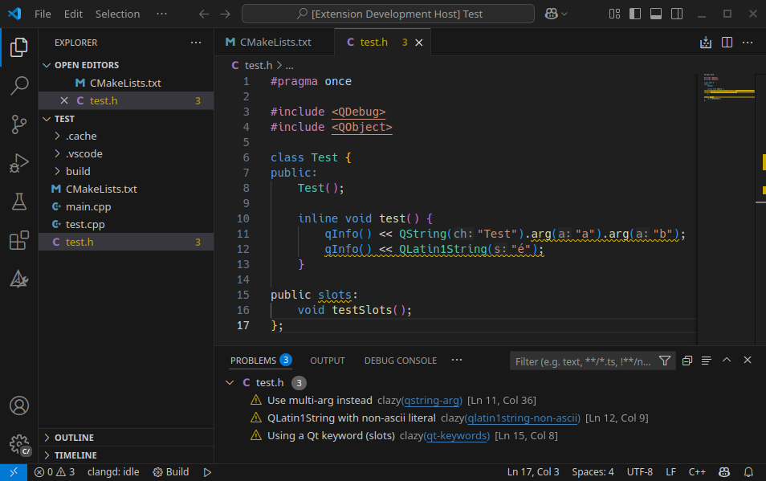

# Clazy for VSCode

VSCode extension for [Clazy](https://invent.kde.org/sdk/clazy).

## Features

- Lint files.
- Quick fixes.
- Show link to Clazy check's document.

## Requirements

This extension requires `clazy-standalone` binary. You can find the build instruction [here](https://invent.kde.org/sdk/clazy#build-instructions), or download from your distro's repo. Additionally, `clazy-standalone` requires a [compilation database JSON file](https://invent.kde.org/sdk/clazy#clazy-standalone-and-json-database-support) to work, i.e. CMake's `-DCMAKE_EXPORT_COMPILE_COMMANDS=ON`.

## Extension Settings

The main configuration options:

- `clazy.executable`: Path to Clazy standalone executable. Default is `clazy-standalone`.
- `clazy.checks`: Array of clazy checks. Default are `level0` and `level1`.
- `clazy.buildPath`: Path to the build folder. This folder should be where the compilation database JSON file locates at.
- `clazy.lintOnSave`: Automatically lint files when they are saved. Default is `true`.

## Related project

- [Clazy](https://invent.kde.org/sdk/clazy)
- [vscode-clang-tidy](https://github.com/notskm/vscode-clang-tidy)
